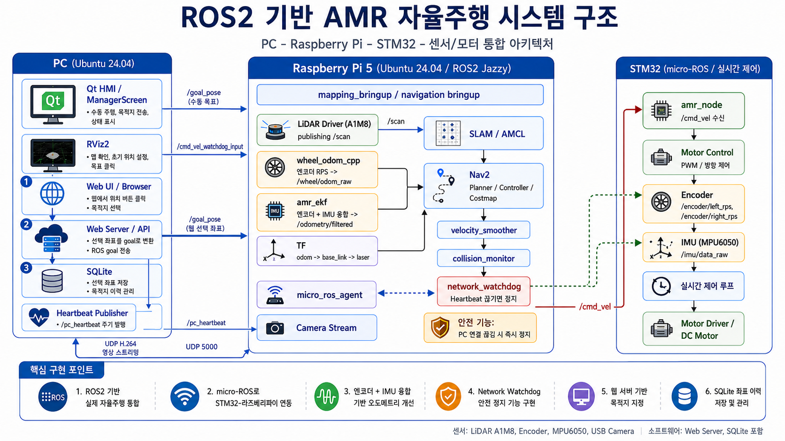
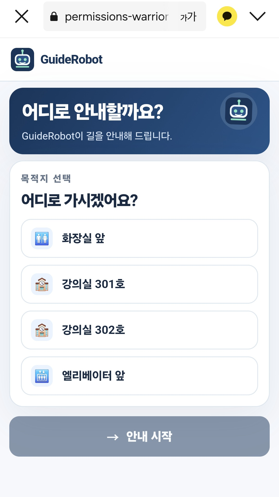
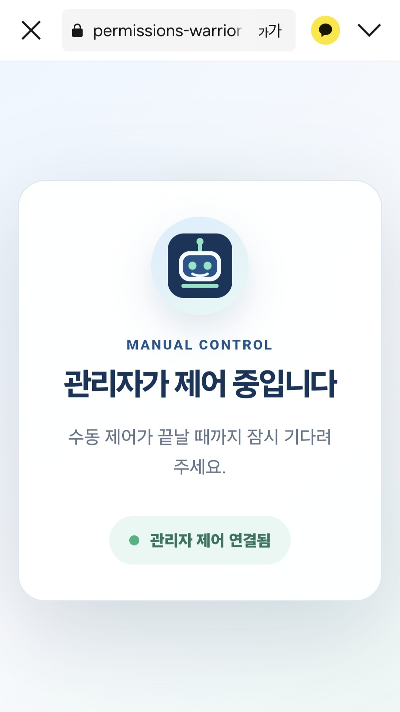
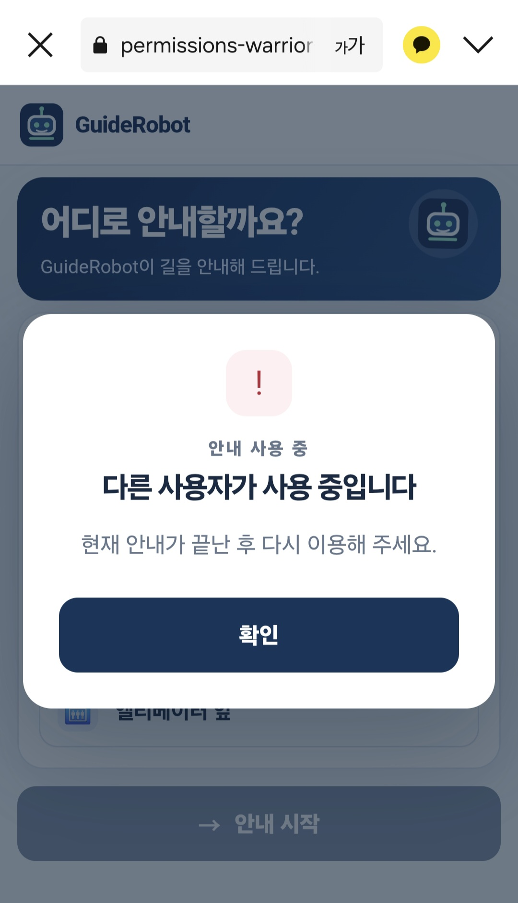
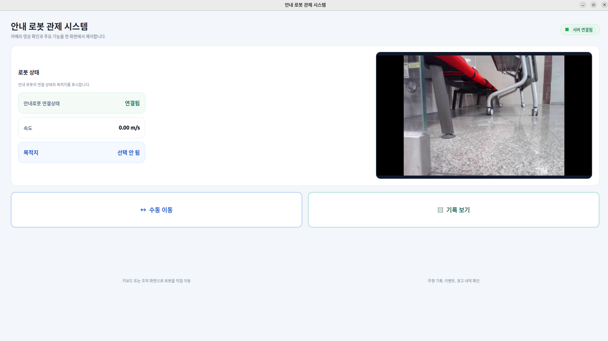
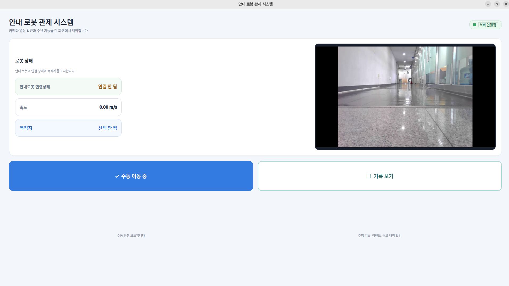
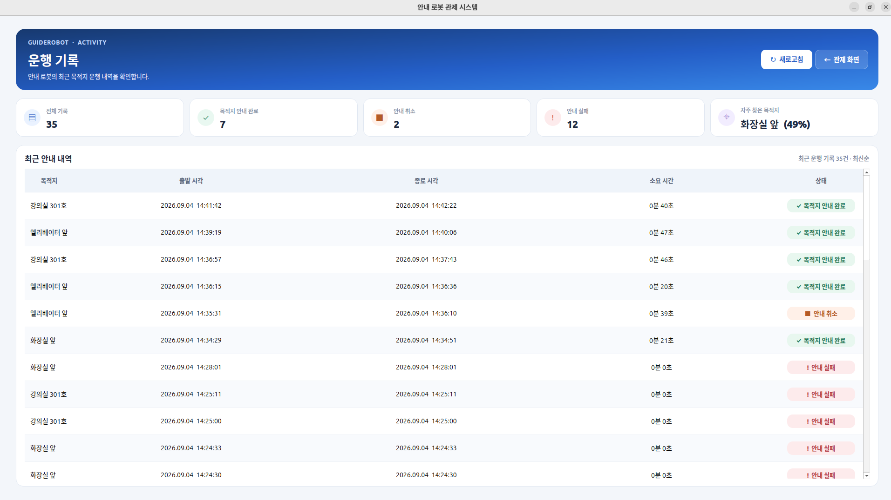

# 와이파이팅 - AMR프로젝트

## 1. 프로젝트 개요

### 프로젝트명

LiDAR 기반 AMR 안내 로봇, GuideRobot

### 프로젝트 소개

본 프로젝트는 LiDAR 센서를 이용해 실내 지도를 작성하고, 사용자가 웹 화면에서 목적지를 선택하면 자율주행 로봇이 해당 위치까지 안내하는 AMR 안내 로봇 시스템이다. 로봇 본체는 STM32 기반 모터/센서 제어부와 Raspberry Pi 기반 ROS2 자율주행부로 나뉘며, 웹 사용자 화면과 Qt 관리자 화면을 통해 안내 요청, 상태 확인, 수동 제어, 운행 기록 확인을 수행한다.

### 개발 배경 및 필요성

학교, 학원, 병원, 공공기관처럼 방문자가 반복적으로 특정 장소를 찾아가야 하는 공간에서는 안내 인력의 부담이 크고, 초행 방문자는 목적지까지의 경로를 파악하기 어렵다. LiDAR SLAM과 Nav2 기반 자율주행을 적용하면 실내 지도 기반 목적지 안내를 자동화할 수 있고, 관리자 화면을 함께 제공하면 현장 운영자가 상태를 확인하고 필요 시 수동으로 개입할 수 있다.

### 프로젝트 목표

- LiDAR 기반 실내 지도 작성 및 저장
- 저장된 지도에서 목적지 좌표 기반 자율주행
- 웹 HMI를 통한 목적지 선택, 안내 시작, 안내 취소, 도착 화면 제공
- Qt 관리자 화면을 통한 로봇 상태, 속도, 카메라 영상, 운행 기록 확인
- STM32와 Raspberry Pi 간 micro-ROS UART 통신
- 엔코더, IMU, LiDAR 데이터를 ROS2 자율주행 스택에 연동
- 네트워크/통신 이상 시 로봇을 정지시키는 안전 구조 적용

### 구현 범위

| 구분 | 구현 내용 | 현재 상태 |
| --- | --- | --- |
| 로봇 하드웨어 제어 | STM32, FreeRTOS, 모터 PWM, 엔코더, MPU6050 IMU, micro-ROS 통신 | 구현됨 |
| 센서/위치 추정 | LiDAR `/scan`, 엔코더 RPS, IMU, wheel odom, EKF/robot_localization | 구현/시도 모듈 존재 |
| SLAM | `slam_toolbox` 기반 mapping launch 및 설정 | 구현됨 |
| Navigation | Nav2, AMCL, planner/controller, costmap, collision monitor | 구현됨 |
| 사용자 웹 UI | 목적지 선택, 안내 시작/취소, 도착 표시, 수동모드 잠금 | 구현됨 |
| 서버/API | FastAPI/Nav2 bridge, SQLite 운행 이력, C++ ROS2 서버, Spring Boot prototype | 구현/병행 버전 존재 |
| 관리자 화면 | Qt6 관리자 앱, 수동 조작, 카메라 스트림, 운행 기록 조회 | 구현됨 |
| 실로봇 E2E 검증 | 목적지 이동 성공, 도착 상태 전환, Qt/웹/로봇 통합 시나리오 | 추가 검증 필요 |

## 2. 역할 분담표

현재 폴더명과 README에 나타난 기준으로 정리한 역할이다. 실제 팀원명은 발표자료 작성 시 확정해서 보완한다.

| 담당 영역 | 관련 폴더/파일 | 주요 업무 |
| --- | --- | --- |
| ROS2 자율주행 | `src/robot_bringup`, `src/mapping_bringup`, `src/navigation_bringup` | SLAM, Nav2, LiDAR, TF, launch 구성 |
| 위치 추정 | `src/wheel_odom_cpp`, `src/amr_ekf`, `src/wheel_odom_tf` | 엔코더 기반 odom, IMU 융합, TF 발행 |
| 안전 통신 | `src/network_watchdog` | PC heartbeat 감시, timeout 시 `/cmd_vel` 정지 발행 |
| STM32 펌웨어 | `AMR`, `AMR_project`, `AMR_Test` | 모터 PWM, 엔코더, IMU, micro-ROS 클라이언트 |
| 웹 서버/API | `Webserver/Server`, `Webserver/hyunbeen/src/guiderobot_server` | HTTP API, Nav2 action bridge, 정적 웹 서빙, 운행 이력 |
| 사용자 UI | `Webserver/Jaewook/user-ui-template`, `Webserver/hyunbeen/web` | 목적지 선택 웹 화면, 안내 상태 화면 |
| 관리자 UI | `wifiting_ws/ManagerScreen` | Qt 관리자 화면, 수동 이동, 카메라, 운행 기록 |
| 테스트/검증 | `Webserver/Server/test_navigation_history.py`, `Webserver/haktae/demo/src/test` | API, 상태 전환, 이력 저장 테스트 |

## 3. 요구사항 정의

### 기능 요구사항

| ID | 요구사항 | 구현 근거 |
| --- | --- | --- |
| FR-01 | 사용자는 웹 화면에서 목적지를 선택할 수 있어야 한다. | `Webserver/Jaewook/user-ui-template/app.js` |
| FR-02 | 목적지는 화장실 앞, 301호, 302호, 엘리베이터 앞을 지원한다. | `Webserver/Server/config.yaml`, 웹 UI destination map |
| FR-03 | 목적지 선택 후 서버가 Nav2 `NavigateToPose` 목표를 전송해야 한다. | `Webserver/Server/server.py` |
| FR-04 | 안내 진행 중 사용자가 안내 취소를 요청할 수 있어야 한다. | `POST /api/command {"command":"cancel"}` |
| FR-05 | 도착 시 사용자 화면이 도착 완료 상태로 전환되어야 한다. | 웹 UI `status: arrived` 처리 |
| FR-06 | 관리자는 수동모드를 켜고 로봇을 직접 조작할 수 있어야 한다. | `wifiting_ws/ManagerScreen/mainwindow.cpp` |
| FR-07 | 수동모드 중 일반 사용자의 목적지 요청은 막혀야 한다. | `/api/manual-mode`, `manual_mode` 상태 |
| FR-08 | 로봇 운행 이력을 DB에 저장하고 조회할 수 있어야 한다. | SQLite `navigation_history` |
| FR-09 | LiDAR scan으로 지도 작성 및 장애물 인식이 가능해야 한다. | `slam_toolbox`, Nav2 costmap 설정 |
| FR-10 | 엔코더와 IMU 정보를 이용해 로봇 위치/속도를 추정해야 한다. | `wheel_odom_cpp`, `amr_ekf`, `robot_localization` |
| FR-11 | micro-ROS 연결이 끊기거나 heartbeat가 끊기면 로봇을 정지해야 한다. | STM32 disconnect stop, `network_watchdog` |

### 비기능 요구사항

| 구분 | 요구사항 |
| --- | --- |
| 안전성 | 통신 끊김, 수동모드 전환, 안내 취소 시 모터 정지 명령을 우선 처리 |
| 사용성 | 목적지 선택과 안내 상태를 큰 버튼/명확한 문구로 표시 |
| 유지보수성 | ROS2 패키지별로 bringup, odom, EKF, watchdog, 서버 기능 분리 |
| 확장성 | 목적지 좌표를 YAML 설정에서 관리하여 맵 변경 시 수정 가능 |
| 기록성 | 안내 시작/종료/취소/실패 결과를 SQLite에 저장 |

## 4. 시스템 설계

### 전체 시스템 구성도

```text
[사용자 웹 HMI]
       |
       | HTTP /api/command, /api/status
       v
[FastAPI 또는 ROS2 C++ 서버]
       |
       | Nav2 NavigateToPose action
       v
[Raspberry Pi / ROS2 Jazzy]
       |
       | /scan, /odom, /cmd_vel, TF
       v
[Nav2 + SLAM Toolbox + AMCL + Costmap]
       |
       | /cmd_vel
       v
[micro-ROS Agent] <---- UART/DMA ----> [STM32 + FreeRTOS]
                                      |
                                      | PWM/GPIO/I2C/Encoder
                                      v
                         [모터, 엔코더, MPU6050 IMU]

[Qt 관리자 화면]
       | HTTP 상태/이력 조회, /manual_mode, /cmd_vel_watchdog_input
       v
[서버 및 ROS2 토픽]
```

### 데이터 흐름도

```text
LiDAR
  -> /scan
  -> SLAM Toolbox 또는 AMCL
  -> map -> odom TF

STM32 엔코더
  -> /encoder/left_rps, /encoder/right_rps
  -> wheel_odom_cpp
  -> /wheel/odom_raw

STM32 IMU
  -> /imu/data_raw
  -> EKF 또는 robot_localization
  -> /odometry/filtered 또는 /odom

Nav2
  -> cmd_vel_smoothed
  -> collision_monitor
  -> /cmd_vel_watchdog_input 또는 /cmd_vel
  -> STM32 모터 제어
```

### 주요 ROS2 토픽

| 토픽 | 타입 | 역할 |
| --- | --- | --- |
| `/scan` | `sensor_msgs/LaserScan` | LiDAR scan 데이터 |
| `/encoder/left_rps` | `std_msgs/Float32` | 왼쪽 바퀴 회전 속도 |
| `/encoder/right_rps` | `std_msgs/Float32` | 오른쪽 바퀴 회전 속도 |
| `/encoder/left_raw_ticks` | `std_msgs/Int32` | 왼쪽 엔코더 누적 tick |
| `/encoder/right_raw_ticks` | `std_msgs/Int32` | 오른쪽 엔코더 누적 tick |
| `/imu/data_raw` | `sensor_msgs/Imu` | MPU6050 IMU 원시 데이터 |
| `/wheel/odom_raw` | `nav_msgs/Odometry` | 바퀴 기반 odometry |
| `/odometry/filtered` | `nav_msgs/Odometry` | EKF 융합 결과 |
| `/odom` | `nav_msgs/Odometry` | robot_localization 기반 Nav2 odom 출력 |
| `/cmd_vel` | `geometry_msgs/Twist` | 최종 로봇 속도 명령 |
| `/cmd_vel_watchdog_input` | `geometry_msgs/Twist` | watchdog 적용 전 속도 명령 |
| `/manual_mode` | `std_msgs/Bool` | 관리자 수동 제어 상태 |
| `/speed_mps` | `std_msgs/Float32` | 관리자 화면 속도 표시 |
| `/guide_robot/destination` | `std_msgs/String` | 관리자 화면 목적지 표시 |

### HTTP API

| API | 메서드 | 역할 |
| --- | --- | --- |
| `/api/status` | GET | 로봇 상태, 안내 상태, 수동모드, 남은 거리 확인 |
| `/api/history` | GET | 최근 안내 이력 조회 |
| `/api/command` | POST | 목적지 안내 시작 또는 안내 취소 |
| `/api/manual-mode` | POST | 관리자 수동모드 설정 |
| `/` | GET | 사용자 웹 HMI 정적 파일 제공 |

## 5. 하드웨어 구성

| 구성품 | 역할 | 코드/설정 근거 |
| --- | --- | --- |
| Raspberry Pi | ROS2 Jazzy, micro-ROS Agent, LiDAR, SLAM/Nav2 실행 | `src/robot_bringup/README.md` |
| STM32F4 계열 보드 | 모터/센서 제어, micro-ROS 클라이언트 | `AMR_project`, `AMR_Test`, `AMR` |
| Slamtec/RPLIDAR A1M8 | 실내 scan 데이터 수집 | `sllidar_ros2`, `lidar_baud=115200` |
| MPU6050 | IMU 가속도/자이로 데이터 수집 | `freertos.c`, `I2C1` 또는 `I2C2` |
| DC 기어드 모터 + 엔코더 | 차동구동 이동 및 wheel odom 계산 | encoder RPS/tick publisher |
| L298N 모터 드라이버 | PWM/GPIO 기반 모터 구동 | STM32 `set_motor`, TIM3 PWM |
| PC/노트북 | RViz, 관리자 화면, 개발/테스트 | `pc.launch.py`, `ManagerScreen` |
| 카메라 스트림 | 관리자 화면 영상 확인 | GStreamer UDP 5000 수신 |

## 6. 소프트웨어 구성

| 영역 | 기술 스택 |
| --- | --- |
| OS | Ubuntu 24.04, ROS2 Jazzy 대상 |
| 임베디드 | STM32CubeMX, STM32 HAL, FreeRTOS, micro-ROS, C |
| ROS2 | rclcpp, rclpy, Nav2, SLAM Toolbox, AMCL, robot_localization, tf2_ros, sllidar_ros2 |
| 위치 추정 | wheel odometry, custom EKF, robot_localization EKF |
| 서버 | Python FastAPI/Uvicorn, ROS2 rclpy, SQLite, YAML |
| 서버 prototype | Java 21, Spring Boot, Gradle |
| 사용자 UI | HTML, CSS, JavaScript |
| 관리자 UI | Qt6 Widgets, Qt Network, Python helper, GStreamer |
| DB | SQLite `navigation_history` |

## 7. 개발 환경 구축 및 실행 방법

### ROS2 워크스페이스 빌드

```bash
cd ~/ros2_ws
source /opt/ros/jazzy/setup.bash
rosdep install --from-paths src --ignore-src -r -y
colcon build --symlink-install
source install/setup.bash
```

### SLAM 실행

```bash
ros2 launch robot_bringup mapping.launch.py
```

LiDAR 또는 MCU 포트가 기본값과 다르면 launch argument로 변경한다.

```bash
ros2 launch robot_bringup mapping.launch.py \
  lidar_port:=/dev/ttyUSB0 \
  lidar_baud:=115200 \
  agent_device:=/dev/ttyACM0 \
  agent_baud:=115200
```

### 저장된 맵으로 Navigation 실행

```bash
ros2 launch robot_bringup navigation.launch.py \
  map:=/home/iot7272/maps/site.yaml
```

다른 bringup 경로를 사용할 경우:

```bash
ros2 launch navigation_bringup navigation.launch.py \
  map:=/home/iot7272/Desktop/maps/my_map.yaml
```

### FastAPI 서버 실행

```bash
cd Webserver/Server
python3 -m pip install -r requirements.txt
python3 server.py
```

기본 접속 주소:

```text
http://서버IP:8080/
```

### Qt 관리자 화면 빌드/패키징

```bash
cd wifiting_ws/ManagerScreen
cmake -S . -B build
cmake --build build
cmake --build build --target package
```

관리자 화면은 `/api/status`, `/api/history`, `/api/manual-mode`를 호출하고, 키보드 수동 조작 시 `/cmd_vel_watchdog_input`으로 `Twist`를 발행한다.

## 8. 테스트 결과 정리

### 확인된 테스트/검증 항목

| 테스트 항목 | 입력/조건 | 예상 결과 | 현재 확인 내용 | 결과 |
| --- | --- | --- | --- | --- |
| 정적 웹 서빙 | `GET /` | `index.html` 반환 | `TEAMREADME.md`에 curl 확인 기록 | PASS |
| 상태 API | `GET /api/status` | 상태 JSON 반환 | idle/manual_mode 응답 확인 기록 | PASS |
| 목적지 ID 검증 | 잘못된 destination | 400 에러 | C++ 서버 README/TEAMREADME 확인 | PASS |
| Nav2 미실행 상태 | 목적지 요청 | 503 에러 | `nav2_unavailable` 확인 기록 | PASS |
| 안내 취소 API | `{"command":"cancel"}` | 취소 요청 처리 | 서버 코드 및 확인 기록 존재 | PASS |
| 수동모드 반영 | `/manual_mode` 또는 `/api/manual-mode` | 웹/서버 상태에 반영 | 1초 이내 반영 확인 기록 | PASS |
| SQLite 운행 이력 | start/finish/list_recent | 최신순 이력 저장 | 테스트 코드 존재 | PASS |
| Nav2 목적지 이동 | 실제 map 좌표 목적지 요청 | 로봇 이동 시작 | 실로봇/Nav2 필요 | PASS |
| 도착 상태 전환 | Nav2 success | 웹 도착 화면 표시 | 실좌표/실로봇 필요 | PASS |
| Qt-서버-로봇 E2E | 관리자 화면 연결 | 수동모드/상태/이력 정상 | 실제 앱 연동 확인 필요 | PASS |
| 카메라 스트림 | UDP 5000 H264 | 관리자 화면 영상 표시 | 코드 구현됨, 실영상 확인 필요 | PASS |


## 9. 트러블 슈팅 기록

| 문제 | 원인 | 해결/대응 |
| --- | --- | --- |
| PC에서 Pi ROS2 토픽이 보이지 않음 | `ROS_DOMAIN_ID`, DDS discovery, 방화벽, Wi-Fi client isolation 문제 | 양쪽 `ROS_DOMAIN_ID=30`, `ROS_AUTOMATIC_DISCOVERY_RANGE=SUBNET`, ping 및 multicast 확인 |
| micro-ROS Agent 미설치 | `micro_ros_agent` 패키지 없음 | launch는 경고 후 계속 실행, STM32 토픽/모터 명령은 agent 설치 후 확인 |
| LiDAR 포트 변경 | USB 재연결 시 `/dev/ttyUSB*` 번호 변경 | `/dev/serial/by-id/...CP2102...` 고정 경로 사용 |
| 엔코더/모터 방향 불일치 | H-bridge IN1/IN2 또는 encoder A/B 극성 차이 | 손으로 전진 회전 시 RPS 양수 확인, forward `cmd_vel` 방향 재검증 |
| PID 적용 시 불안정 | 바퀴 지름/감속비/목표 RPS 보정값 불일치 | `ENABLE_WHEEL_PID=0`으로 두고 feedforward 및 실측값 재캘리브레이션 |
| Nav2 목표 성공 확인 불가 | 실제 map 좌표와 Nav2 runtime 필요 | `config.yaml` 목적지 좌표 동기화 후 실로봇 테스트 진행 |
| 프레임 이름 혼재 | `base_link`와 `base_footprint`, `/odom`과 `/odometry/filtered`가 bringup별로 다름 | 최종 시연용 launch 하나를 선택하고 TF/frame 규칙 통일 |
| Python test 실패 | Windows에 IANA timezone DB 없음 | `tzdata` 설치 또는 Ubuntu에서 테스트 |

## 10. 최종 산출물 현황

| 산출물 | 현재 위치/상태 |
| --- | --- |
| 프로젝트 소개 README | `README.md`, 내용 보강 필요 |
| ROS2 bringup 문서 | `src/robot_bringup/README.md` |
| 시스템 설계/구성 | 본 문서 4~6장 |
| STM32 펌웨어 | `AMR`, `AMR_project`, `AMR_Test` |
| 사용자 웹 UI | `Webserver/Jaewook/user-ui-template`, `Webserver/hyunbeen/web` |
| 서버/API | `Webserver/Server`, `Webserver/hyunbeen/src/guiderobot_server` |
| 관리자 화면 | `wifiting_ws/ManagerScreen` |
| 테스트 코드 | Python unittest, Spring Boot tests, ROS package lint tests |
| 스크린샷/시연영상 | `Images_and_Videos` |
| PT 자료 | 현재 폴더에서 별도 PPT 파일 미확인 |

## 시스템 구성도



## 결과물 사진
### 사용자 화면
- 목적지 선택 화면
  - 
- 안내중 화면
  - 
- 목적지 도착 화면
  -  
- 관리자 제어시 사용자 접근 차단
  -  
- 다른 사용자 사용시 접근 차단
  -  


### 관리자 화면
- 관리자 기본 콘솔 화면
  - 
- 수동모드 전환 화면
  -  
- 운행기록 열람
  - 


### SLAM 결과물
- 측정한 Map 사진
  -    


## 결과물 작동 영상
- 사용자 입장 안내시연 영상
  - <video controls src="Images_and_Videos/KakaoTalk_20260904_144317872.mp4" title="alt text"></video>
- 안내시 관리자 화면
  - <video controls src="Images_and_Videos/KakaoTalk_20260904_144331341.mp4" title="Title"></video> 
- 수동모드 제어 영상
  - <video controls src="Images_and_Videos/KakaoTalk_20260904_144408644.mp4" title="alt text"></video>